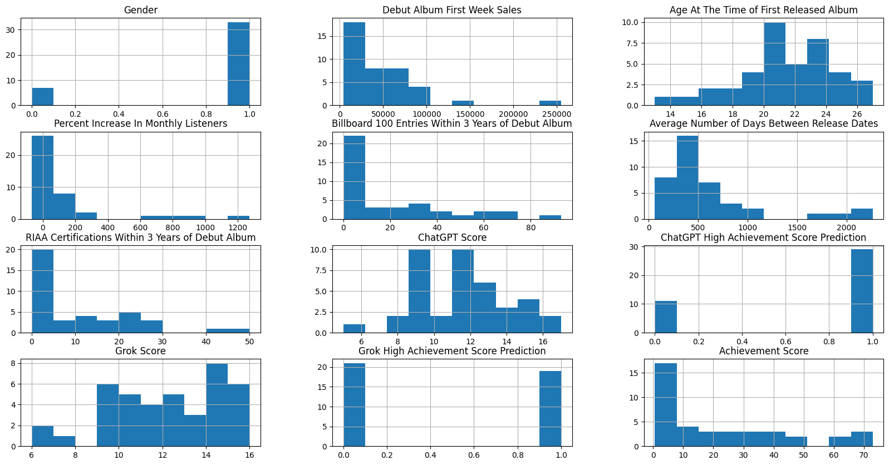
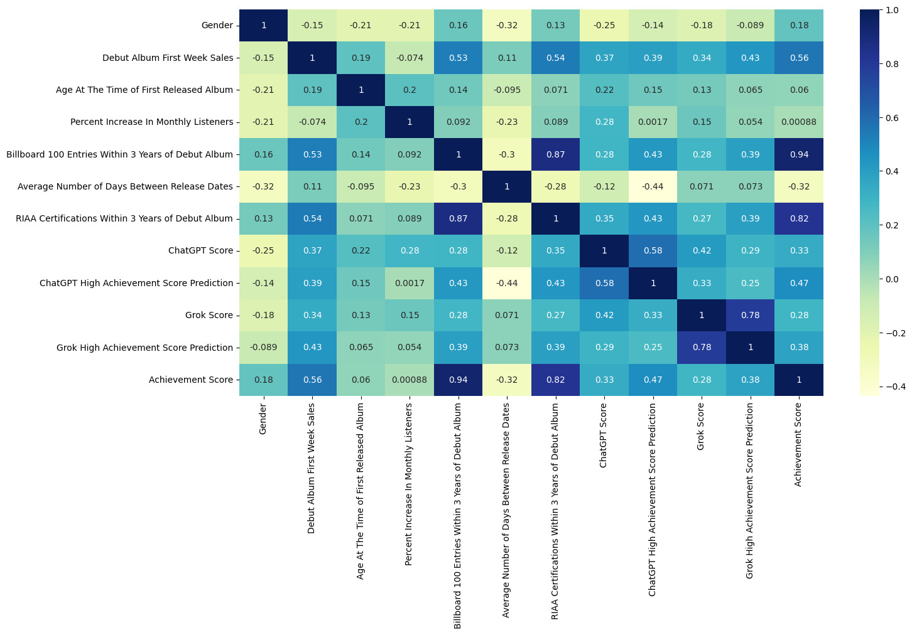

# Can AI Predict A Rapper's Future? 🤖🎵

## Introduction 💡
Is it possible to predict a rapper's future? This project aims to answer that question by using AI and machine learning to forecast the future achievement score of a rapper based on the first three years of their music career.

The achievement score serves as a **QUANTITATIVE** metric to interpret the success and popularity of an artist within the hip-hop/rap genre. The achievement score is based solely on numerically measured categories including RIAA certifications, Billboard 100 entries, etc. and do not take into account factors like awards which can be subjective and influenced by personal opinions or bias. It's reasonable to assume that artists with higher achievement scores have amassed significant milestones and recognition in their musical careers in comparison to those with lower scores.

The goal of this project to build a robust predictive model that can anticipate a rapper's future achievement score with a high degree of accuracy. By leveraging this model, stakeholders in the music industry can better understand the factors influencing an artist's success and make strategic decisions to support their careers.

**Here is a link to the YouTube video explaining the project:** [Can AI Predict A Rapper's Future?]() (PS: I really recommend watching it 😃)

### DISCLAIMER: This project is intended for educational and research purposes only. The predictions generated by the achievement score are based solely on calculations and statistical models trained on historical data. It's important to note that predicting an artist's future achievement score is inherently speculative, and the results should be interpreted with caution. While the model leverages various metrics and machine learning techniques to make predictions, it's impossible to guarantee the accuracy of these forecasts.

## Project Overview 📝
This project is divided into three main components:

1. **Data Collection**: Collecting and aggregating data from various sources including Billboard 100 entries, RIAA certifications, Spotify, YouTube, and more.

2. **Data Preprocessing**: Cleaning and transforming the raw data into a format suitable for machine learning. This includes handling missing values, normalizing data, and engineering new features.

3. **Model Development**: Building and training a machine learning model to predict the future achievement score of a rapper based on the first three years of their music career.

## Data Collection 🗂️

The data collection process for this project involved gathering information on various metrics related to the success and popularity of rappers who released their debut albums between 2016 and 2020. This was also referred to as the *"Clout Era"* in hip-hop, characterized by the rise of streaming platforms and social media as dominant forces in the music industry. The era produced many of the well-known rappers of today, including Lil Uzi Vert, Lil Baby, and Megan Thee Stallion and inspired numerous trends that new artists continue to follow.

The primary sources of data included reputable music databases, streaming platforms, and industry reports. Here's an overview of the data sources and the metrics obtained:

**RIAA Certifications:** Data on the number of certifications awarded by the Recording Industry Association of America (RIAA) for albums and singles released by the artists.

**Billboard 100 Entries:** Information on the number of entries made by the artists on the Billboard Hot 100 chart within a specified timeframe.

**Spotify Metrics:** Metrics such as total monthly listeners, total streams, and appearances on distinct Spotify playlists with 200+ followers, providing insights into the artists' popularity and reach on the streaming platform.

**YouTube Views:** The total number of views garnered by the artists' music videos and other content on the YouTube platform, reflecting their online presence and audience engagement.

**AI Analysis Scores:** The sentiment analysis of the lyrics of the artists' songs from ChatGPT and Grok, providing insights rating from artificial intelligence.

**Other Artist Attributes:** Additional attributes such as gender, debut album details, debut album first-week sales, and age at the time of the first released album were also considered to provide context and background information on the artists.

The data collection process ensured the inclusion of a diverse range of artists and a comprehensive set of metrics to facilitate the development of a robust predictive model. Careful attention was paid to data integrity and accuracy to maintain the reliability of the analysis and predictions.

**Note:** It's important to acknowledge that the data collected is based on publicly available information and may have limitations in terms of coverage and completeness. Additionally, the project adheres to ethical guidelines and respects the privacy and intellectual property rights of the artists and data providers.

For rappers whose first week album sales were not available online, the value was subsituted with the first week album sales of the artist with the lowest number of sales (YBN Nahmir - 4000).

As the project continues, I plan to update the dataset monthly and add new predictiors and achievement score factors to the model.

**Current data is as of March 1, 2024.**

## Data Collection Sources 🔎
Billboard 100 Entries - [Billboard.com](https://www.billboard.com/)

RIAA Certification Data - [RIAA.com](https://www.riaa.com/)

Spotify Data - [Spotify API](https://developer.spotify.com/documentation/web-api)/[Kworb.net](https://kworb.net/)/[Song Stats](https://songstats.com/)

YouTube Views - [Kworb.net](https://kworb.net/)

Lyrics - [AZLyrics.com](https://www.azlyrics.com/)

First Week Album Sales - [Wikipedia](https://en.wikipedia.org/)/[Hits Daily Double](https://hitsdailydouble.com/)

## Data Exploration and Visualization 📊

Currently, I used the data from 50+ rappers and here you can see a histogram of the distribution of different metrics along with the heatmap of the correlation between the different features in the dataset.

### Histogram of Different Metrics

Gender: Female = 0, Male = 1

AI Achievement Score Prediction: Low Achievement Score = 0, High Achievement Score = 1

### Heatmap of Correlation Matrix

# Model Selection and Training 🌐💪🏽

The RandomForestRegressor model from the scikit-learn library was selected for predicting future achievement scores of rappers within the hip-hop/rap genre. RandomForestRegressor is a powerful ensemble learning method based on decision trees, capable of handling complex relationships in the data and providing accurate predictions. For more information on the model, you can visit the [scikit-learn documentation](https://scikit-learn.org/stable/modules/generated/sklearn.ensemble.RandomForestRegressor.html). Or you can watch this video that explains it very well: [Random Forest Explained](https://www.youtube.com/watch?v=cIbj0WuK41w).

The data was split into a training set which was composed of 80% of the data and a test set which was composed of 20% of the data. The model was trained on the training set and evaluated on the test set to ensure that it could make accurate predictions on unseen data.

**The model was trained using the following features:**

Gender

Debut Album First Week Sales

Age at Debut Album Release

Billboard 100 Entries Within 3 Years of Debut Album Release

RIAA Certifications Within 3 Years of Debut Album Release

Spotify Total Monthly Listeners Perecent Change Within 3 Years of Debut Album Release

ChatGPT Sentiment Analysis Score

Grok Sentiment Analysis Score

ChatGPT High Achievement Score Prediction

Grok High Achievement Score Prediction

## Model Evaluation and Results 🤔🧾

The average R^2 value, ranging between **60-64%**, indicates that approximately 60% of the variability in the achievement scores can be explained by the features included in our model. This suggests that our model captures a significant portion of the underlying patterns in the data, providing meaningful insights into the factors influencing an artist's success.

Furthermore, the average percent error of about **33%** may seem high at first glance. However, when considering the precision of our predictions up to nine decimal places, this error becomes relatively small. In practical terms, this means that our model's predictions are typically within a reasonable range of the actual achievement scores, showcasing its ability to make accurate estimations.

Additionally, by examining the predicted values for each artist in the dataset, we can see that the model's outputs align closely with the actual achievement scores. This level of accuracy further validates the effectiveness of our model in capturing the complex relationships between various predictors and an artist's success in the hip-hop/rap genre.

Overall, these results demonstrate that our predictive model offers valuable insights into the future achievement scores of artists, making it a valuable tool for stakeholders in the music industry seeking to understand and anticipate trends in the hip-hop/rap genre.

|Artist|Actual Achievement Score|Predicted Achievement Score|Percent Error|
|---|---|---|---|
Famous Dex|3.730750148|4.317011559|15.71430378|
Ugly God|1.490086713|2.183779779|46.55387233|
Lil Yachty|20.57307638|19.21224549|6.614620311|
6ix9ine|20.86992547|21.99800835|5.405303851|
Trippie Redd|32.46875851|31.64601554|2.533952647|
XXXTENTACION|46.69593739|41.98319337|10.09240693|
Playboi Carti|23.9803925|22.25835648|7.181016841|
Lil Uzi Vert|50.90986556|52.70860821|3.533190722|
Blueface|6.329950166|5.744654868|9.246444012|
Juice WRLD|62.18058183|60.62490168|2.50187454|
Comethazine|3.512394662|3.594292156|2.331671188|
Tee Grizzley|7.223956577|7.71345314|6.776017517|
Megan Thee Stallion|27.102912|29.0526915|7.193985281|
YBN Nahmir|4.465855498|4.190777889|6.159572551|
Almighty Jay|0.892095145|1.158098461|29.81781904|
Cordae|5.895264901|6.843539833|16.08536593|
Young M.A|4.244398072|4.972562597|17.15589615|
City Girls|6.438926226|7.948906915|23.45081518|
MadeinTYO|5.089823892|4.822271406|5.256615786|
G Herbo|6.491895479|5.316628264|18.10360655|
Cardi B|40.33630563|40.82423622|1.209656111|
Lil Pump|13.58683712|14.41699138|6.109989039|
Aminé|7.707721421|7.132791006|7.459148865|
21 Savage|59.14996409|55.31612975|6.481549736|
Kodak Black|32.49557963|29.7594792|8.419915766|
Desiigner|7.59103043|5.749678077|24.25694864|
KYLE|6.738996525|6.402778135|4.989146218|
Ski Mask The Slump God|9.644456313|11.20159025|16.14537809|
Roddy Ricch|24.47107599|27.33902969|11.71976948|
DaBaby|37.13192283|46.13741951|24.25270763|
YK Osiris|2.824582809|5.153652066|82.45710656|
YN Jay|0.566441299|1.368581664|141.6105015|
Bhad Bhabie|4.045668685|4.051242604|0.137774975|
Lil Tjay|19.95166817|19.33699599|3.080805934|
Post Malone|71.28989179|62.91180115|11.75214386|
Tay-K|2.628888094|3.178454631|20.90490417|
Smokepurpp|3.515855894|3.692577527|5.026418569|
NAV|14.7338391|16.13835326|9.532574316|
Matt OX|0.724986576|1.501159468|107.0603123|
Lil Xan|3.036747056|4.58590014|51.01356996|
Doja Cat|45.41839757|20.13258587|55.67305993|
Lil Baby|72.91955409|67.2642758|7.755503121|
BlocBoy JB|3.518049433|1.553616717|55.83868998|
Teejayx6|0.171596822|1.447618329|743.6160501|
Lil Tecca|15.04375882|13.56307964|9.842481482|
A Boogie Wit da Hoodie|30.59123323|32.00183729|4.611138255|
Youngboy Never Broke Again|66.85827642|64.35122656|3.749797324|
Gunna|41.41590689|46.56867036|12.44150824|
YNW Melly|13.04007789|13.50213094|3.543330449|
Rico Nasty|2.98961338|3.768021871|26.03709552|
Latto|11.56829741|11.6368572|0.592652352|

## Future Improvement and Expansion 📈

In the future, there are several avenues for improving and expanding upon this project:

1. **Incorporating Additional Features:** Including more features related to artists' backgrounds, such as state of origin, label, etc. to enhance the predictive power of the model.

2. **Fine-Tuning Model Parameters:** Experiment with different machine learning algorithms and hyperparameters to optimize model performance further.

3. **Data Augmentation:** Exploring techniques to augment the dataset, such as generating synthetic data points or incorporating external data sources, to increase the diversity and size of the training data.

4. **User Feedback Integration:** Incorporate mechanisms for collecting user feedback on model predictions and use it to iteratively refine and enhance the predictive model.

5. **Continual Model Monitoring and Updating:** Implement a system for monitoring model performance in real-time and periodically retraining the model with new data to ensure its relevance and accuracy over time. I plan to update the data and achivement score monthly and add new predictors to the model.